# Azure Cloud Environment SOC + Honeypot + Live Malicous Traffic
This lab allows me to demonstrates how an Azure honeypot can be used to capture live attacker activity and feed that data into Azure Sentinel for visibility and threat hunting. It shows the lifecycle from spinning up a vulnerable Windows OS machine to visualizing geolocated attacks on a Sentinel workbook.

Goals:
- Deploy a vulnerable Windows 10 virtual machine (honeypot) in Azure.
- Open NSG (Network Security Group) rules to generate inbound traffic (intentionally vulnerable).
- Forward security logs into a LAW (Log Analytics workspace).
- Ingest logs into Azure SIEM (Sentinel) and create visual attack maps.
- Run KQL (Kusto Query Language) to geolocate and analyze attack sources.
- Harden the environment and compare pre/post results.

## Architecture Overview
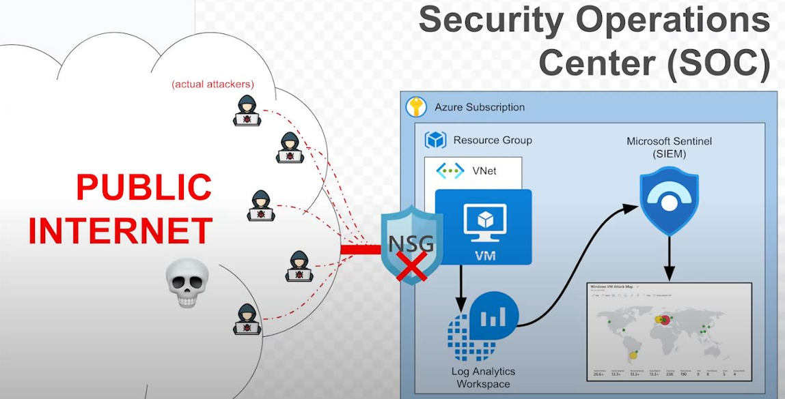

Architecture Components:
- Resource Group
- Virtual Network / Subnet
- Honeypot VM
- Network Security Group (open rules)
- Log Analytics Workspace
- Azure Sentinel (Microsoft Cloud SIEM)
- Watchlist (GeoIP CSV)
- Sentinel Workbook (Attack Map)

## Deployment Summary
1. Create Resource Group.
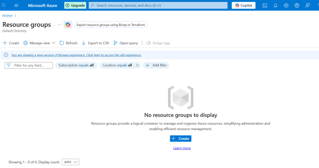
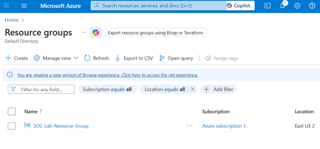

2. Create Virtual Network and Subnet.
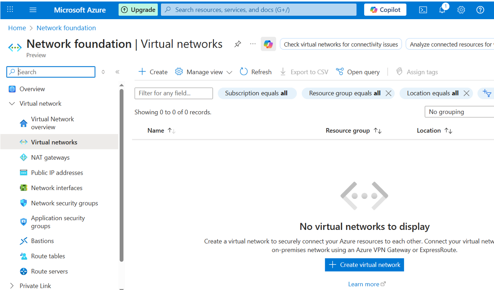
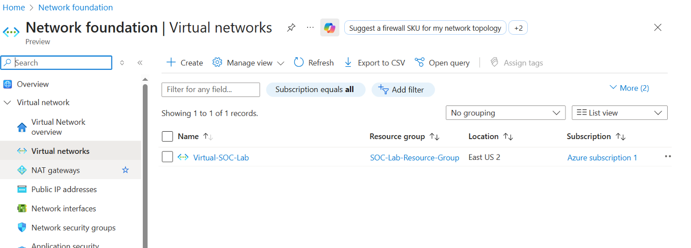

3. Create a virtual machine (honeypot).
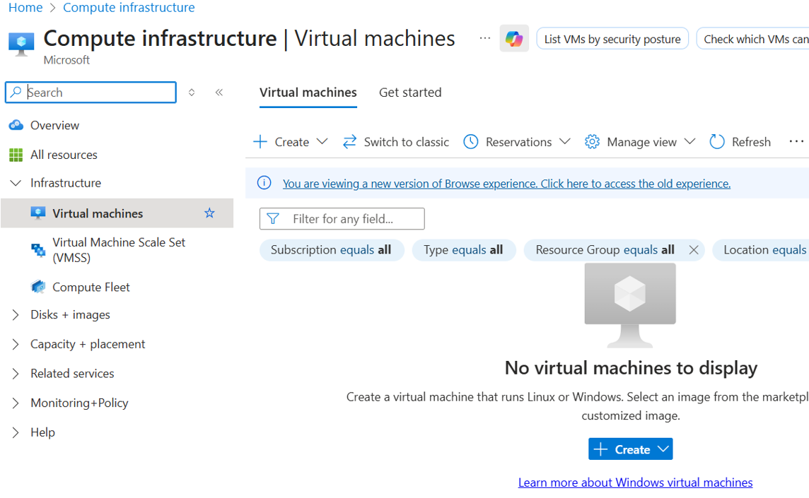
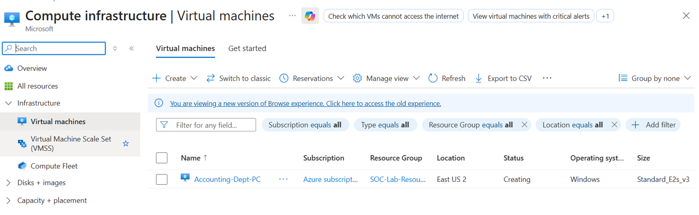

  At this point, the infrastructure looks like this:
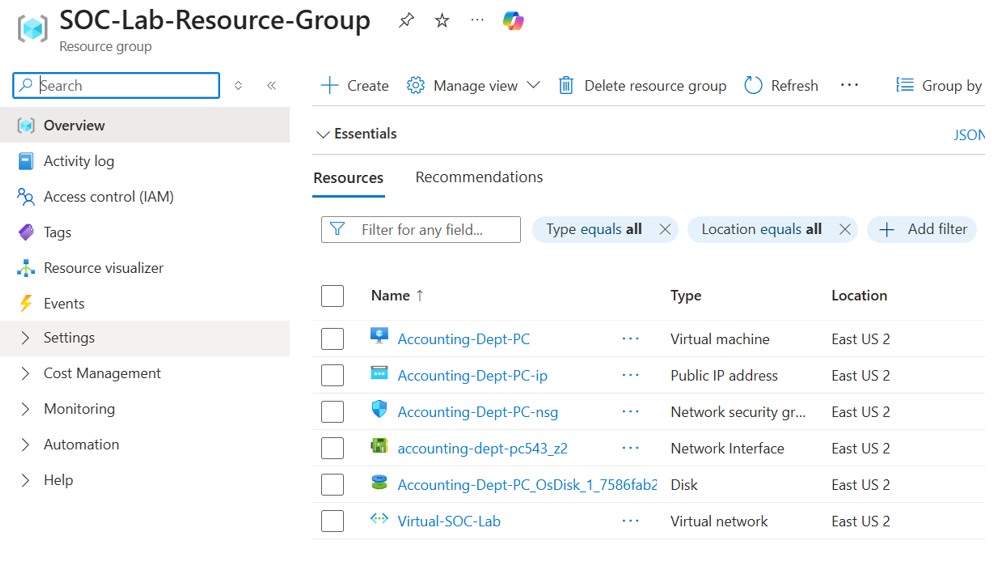

4. Edit Network Security Group to open inbound traffic.
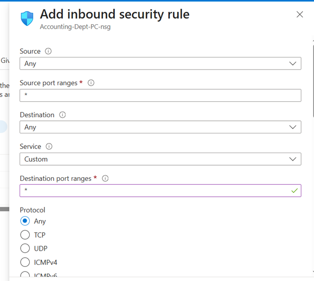
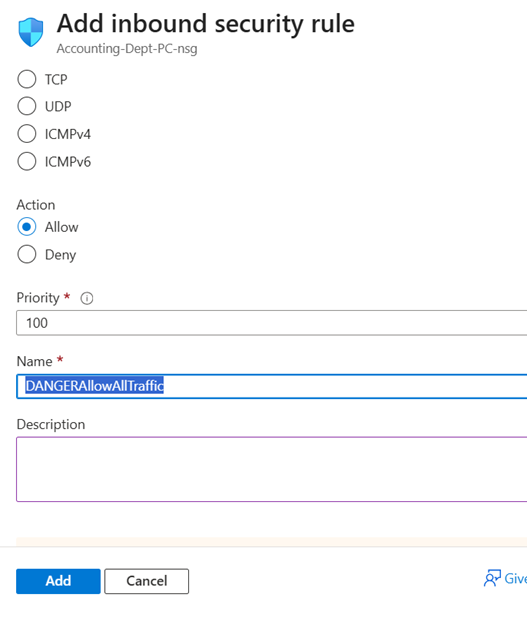
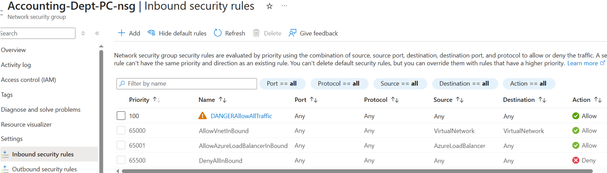

5. Disable local Windows Firewall on the VM (Windows OS Machine). With your local machine, RDP into the VM machine. Then, ping your vulnerable machine to confirm that it's accessible to everyone.
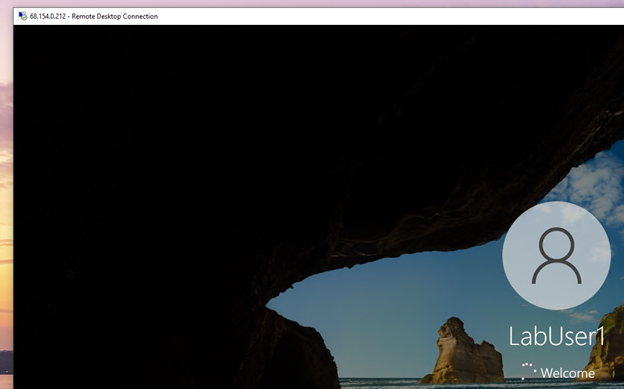

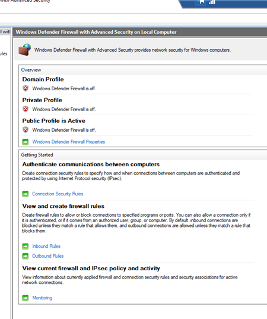

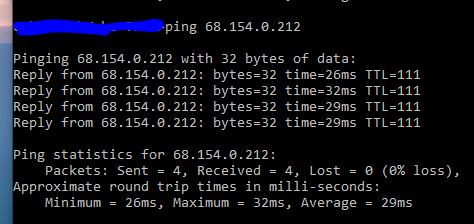

  At this point, our architecture looks like this:
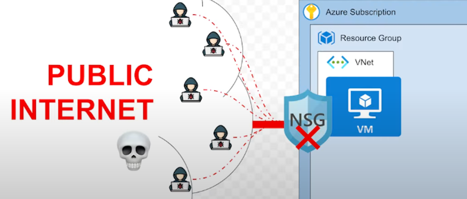

6. Create Log Analytics workspace and connect VM.
   
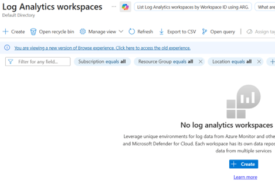
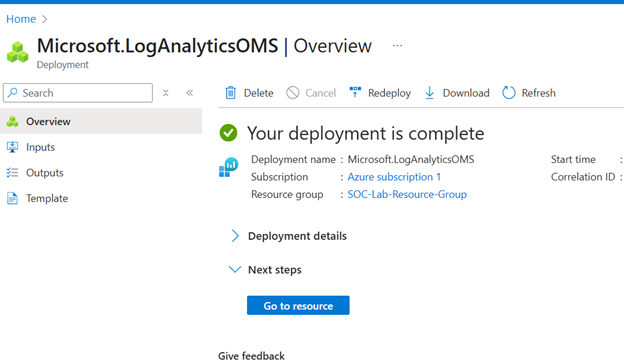

7. Create/enable Azure Sentinel and connect workspace.
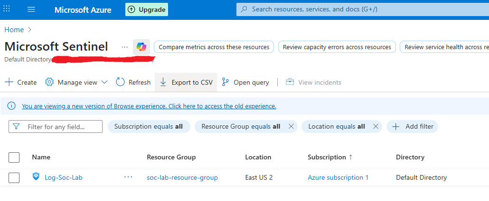

8. Import GeoIP watchlist into Sentinel.

9. Run KQL queries to geo-locate traffic.

10. Create Sentinel workbook visualizing attack map.

11. Harden environment and re-run analysis.
