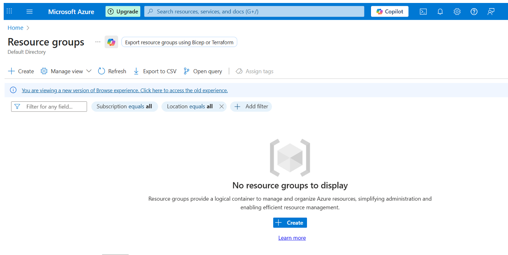

# Azure Cloud Environment SOC + Honeypot + Live Malicous Traffic
## Summary
In this project, I built an Azure-based honeynet + SOC environment, integrating vulnerable decoy systems, telemetry ingestion, and threat-detection visualization. I deployed a honeypot VM exposed to the public internet, routed its security and network logs into Azure Log Analytics and Microsoft Sentinel, and used Kusto queries and watchlist-based geolocation to visualize attacker behavior via visual dashboards. This educational lab helped me learn how to turn raw malicious traffic into actionable insights in SOC context.

## Goals
- Deploy a vulnerable Windows 10 virtual machine (honeypot) in Azure
- Open NSG (Network Security Group) rules to generate inbound traffic (intentionally vulnerable)
- Simulate attacker behavior in Azure by deploying exposed systems to attract real-world reconnaissance and attacks
- Forward security logs into a LAW (Log Analytics workspace)
- Ingest logs into Azure SIEM (Sentinel) and create visual attack maps
- Run KQL (Kusto Query Language) to geolocate and analyze attack sources
- Harden the environment post-attack, then compare metrics and visualization to quantify improvements

## Architecture Overview


Architecture Components:
- Resource Group
- Virtual Network / Subnet
- Honeypot VM
- Network Security Group (open rules)
- Log Analytics Workspace
- Azure Sentinel (Microsoft Cloud SIEM)
- Watchlist (GeoIP CSV)
- Sentinel Workbook (Attack Map)

## Deployment Steps
### 1. Create Resource Group.



### 2. Create Virtual Network and Subnet.


### 3. Create a virtual machine (honeypot).


At this point, the infrastructure looks like this:


### 4. Edit Network Security Group to open inbound traffic.
Add lab NSG rule (Source: `Any`, Destination Port: `*`, Action: `Allow`).


### 5. Disable local Windows Firewall on the VM (Windows OS Machine). 
With your local host machine, RDP into the VM machine. Then, ping your vulnerable machine to confirm that it's accessible to everyone.


At this point, our architecture looks like this:


### 6. Create Log Analytics workspace and connect VM.
   


### 7. Create/enable Azure Sentinel, connect to workspace, and ensure SecurityEvent logs (Windows) are forwarding to Log Analytics.


### 8. Import GeoIP watchlist into Sentinel.
Create a Watchlist (geoip.csv) in Sentinel to hold GeoIP CSV (IP → latitude/longitude). Use the watchlist for KQL geolocation join lookups.


### 9. Run KQL queries to geo-locate traffic.
Below is one example we can use to ask Sentinel Logs to geo-locate alerts and create summarized tables.
```kql
let GeoIPDB_FULL = _GetWatchlist("geoip");
let WindowsEvents = SecurityEvent
| where EventID == 4625
| order by TimeGenerated desc
| evaluate ipv4_lookup(GeoIPDB_FULL, IpAddress, network);
WindowsEvents
| project TimeGenerated, Computer, AttackerIp = IpAddress, cityname, countryname, latitude, longitude
```


### 10. Create Sentinel workbook visualizing attack map.
Create a workbook, add a map visualization using the KQL results with latitude/longitude fields, and configure time ranges and drill-downs for investigation.


## Testing & Results
### Pre-hardening of NSG and VM Firewall Observations
- High volume of inbound connection attempts recorded. Overall, there were 45,836 connection attempts witin a 12 hour period
 ```bash
  2025-10-17T17:31:22.4581272Z to 2025-10-18T05:30:39.2269356Z.
```


- High volume of 'An account failed to logon' messages that originated from EventID 4625. Total of 44,752 attempts within the same time parameters as mentioned above


- GeoIP shows global distribution of sources


### Post-hardening of NSG and VM Firewall Observations
- VM Firewall turned on and Azure NSG setting updated to secure system


## Conclusion + Lesson Learned
This lab experience reinforced several key lessons relevant to SOC and IR; taught me to think like both a defender and an attacker. Seeing how quickly the honeypot was scanned after deployment gave me a real sense of how active the internet threat landscape is:
- Visibility is crucial: Without properly configured logging and telemetry pipelines, even sophisticated attacks remain invisible. Ensuring every layer (NSG, VM OS, Azure diagnostics) feeds data into a central SIEM is critical
- Context matters: Raw events gain meaning when enriched (e.g. with GeoIP lookups, threat intelligence, user context). The difference between an alert and a false positive often lies in enrichment
- Assume compromise, but design for recovery: In real environments, defenses will be bypassed. Having resilient architecture (infrastructure, logging, alerting, alert playbooks) positions an organization for recovery and forensic insight
- Iterative hardening is essential: Running the same detection suite before and after applying controls helps validate the efficacy of each mitigation. It turned abstract recommendations into measurable outcomes


**This lab is for educational and personal enrichment purposes. This project was inspired by [Josh Madakor.](https://youtu.be/g5JL2RIbThM?si=9qM-EVpNHu73wXf0)**
