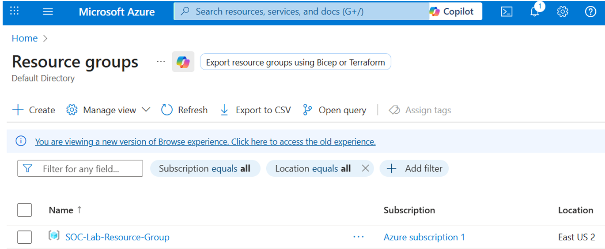
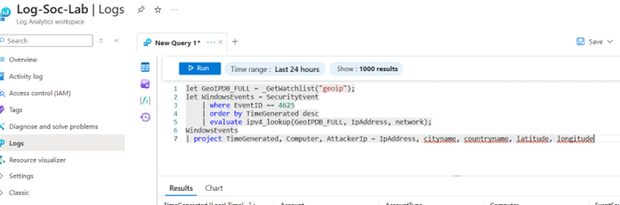

# Azure Cloud Environment SOC + Honeypot + Live Malicous Traffic
## Summary
This lab allows me to demonstrates how an Azure honeypot can be used to capture live attacker activity and feed that data into Azure Sentinel for visibility and threat hunting. It shows the lifecycle from spinning up a vulnerable Windows OS machine to visualizing geolocated attacks on a Sentinel workbook.

## Goals
- Deploy a vulnerable Windows 10 virtual machine (honeypot) in Azure.
- Open NSG (Network Security Group) rules to generate inbound traffic (intentionally vulnerable).
- Forward security logs into a LAW (Log Analytics workspace).
- Ingest logs into Azure SIEM (Sentinel) and create visual attack maps.
- Run KQL (Kusto Query Language) to geolocate and analyze attack sources.
- Harden the environment and compare pre/post results.

## Architecture Overview


Architecture Components:
- Resource Group
- Virtual Network / Subnet
- Honeypot VM
- Network Security Group (open rules)
- Log Analytics Workspace
- Azure Sentinel (Microsoft Cloud SIEM)
- Watchlist (GeoIP CSV)
- Sentinel Workbook (Attack Map)

## Deployment Steps
### 1. Create Resource Group.



### 2. Create Virtual Network and Subnet.


### 3. Create a virtual machine (honeypot).


At this point, the infrastructure looks like this:


### 4. Edit Network Security Group to open inbound traffic.
Add lab NSG rule (Source: `Any`, Destination Port: `*`, Action: `Allow`).


### 5. Disable local Windows Firewall on the VM (Windows OS Machine). 
With your local host machine, RDP into the VM machine. Then, ping your vulnerable machine to confirm that it's accessible to everyone.


At this point, our architecture looks like this:


### 6. Create Log Analytics workspace and connect VM.
   


### 7. Create/enable Azure Sentinel, connect to workspace, and ensure SecurityEvent logs (Windows) are forwarding to Log Analytics.


### 8. Import GeoIP watchlist into Sentinel.
Create a Watchlist (geoip.csv) in Sentinel to hold GeoIP CSV (IP → latitude/longitude). Use the watchlist for KQL geolocation join lookups.


### 9. Run KQL queries to geo-locate traffic.
Below is one example we can use to ask Sentinel Logs to geo-locate alerts and create summarized tables.
```kql
let GeoIPDB_FULL = _GetWatchlist("geoip");
let WindowsEvents = SecurityEvent
| where EventID == 4625
| order by TimeGenerated desc
| evaluate ipv4_lookup(GeoIPDB_FULL, IpAddress, network);
WindowsEvents
| project TimeGenerated, Computer, AttackerIp = IpAddress, cityname, countryname, latitude, longitude
```


### 10. Create Sentinel workbook visualizing attack map.
Create a workbook, add a map visualization using the KQL results with latitude/longitude fields, and configure time ranges and drill-downs for investigation.


## 11. Testing & Results
### Pre-hardening of NSG and VM Firewall Observations:
- High volume of inbound connection attempts recorded. Overall, there were 45,836 connection attempts witin a 12 hour period.
 ```bash
  2025-10-17T17:31:22.4581272Z to 2025-10-18T05:30:39.2269356Z.
```


- High volume of 'An account failed to logon' messages that originated from EventID 4625. Total of 44,752 attempts within the same time parameters as mentioned above.


- GeoIP shows global distribution of sources.


### Post-hardening of NSG and VM Firewall Observations:
- VM Firewall turned on and Azure NSG setting updated to secure system.


## Conclusion + Lesson Learned
